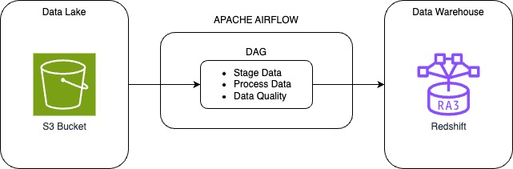
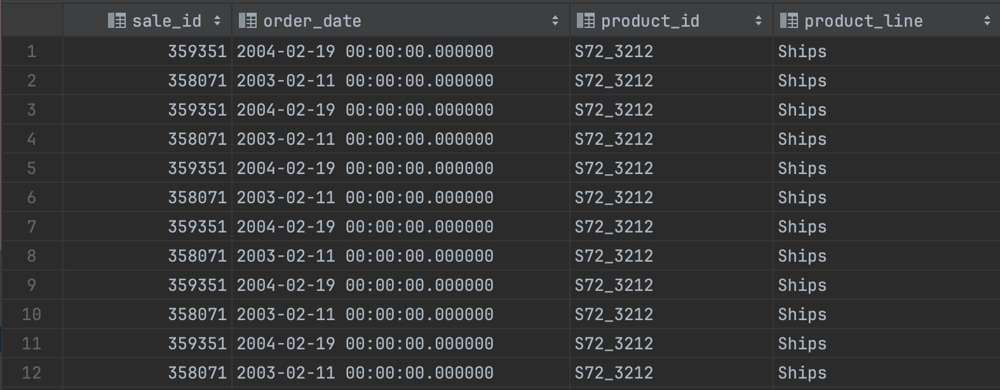
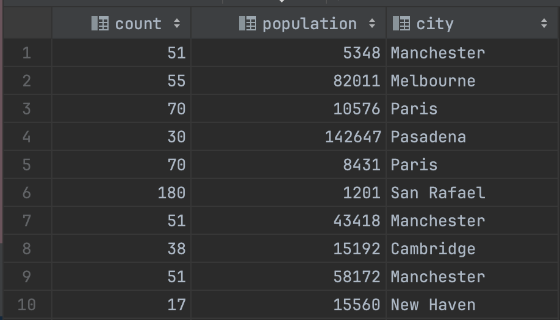

# Capstone-Project

This repository contains the resources for the final project of the Udacity Data Engineering NanoDegree.

This project aims to combine all the concepts and technologies learned throughout the course, and apply it in a correct and thoughful way.

# Data Warehouse for Sales Analysis

## 1. Introduction

A sales company is currently expanding the data department in order to make more decisons based on data. They have the need to have a platform that allows analists and data scientists to access data easily to be able to create insights and train models for business needs.

The data was stored on premises on sql based databases that are very fast for read and write operations but very slow for analytical queries and hard to scale. The decision to go from on premises to the cloud was made. 

The requirements are the following:
* Data needs to be easily available
* Fast analytical queries
* ETL capabilities with easy reausability
* Easy to scale resources if needed
* Data quality is a must

My role in this project was to take the requirements defined and setup a Data Platform and the tools that allowed.

The decision was to setup a S3 bucket that cointains files (CSV and JSON) from the old on premises databases. Then the data is staged and processed using a Redshift Cluster. 
This allows for S3 to serve as a data lake to store raw data in JSON and CSV files that are tranfered directly from the sales data. And Redshift as Data Warehouse for analytics and machine learning purposes.

To schedule and manage ETL capabilities, Apache Airflow will be used. This allows for ETLs to be scheduled and for DAGs and custom operators to be built and shared for reusability.

This way the company is able to:
* Research sales data from several years and create insights
* Schedule daily pipelines that bring new data into Redshift
* Create machine learning models based on the data available in Redshift
* Connect various tools such as:
  * Jupyter notebooks
  * Tableau
  * etc

## 2. Project Overview

The objective is to have a clean dataset present in Redshift. This data set is modeled as a star schema using fact and dimension tables. 
The files are in S3 and using an ETL defined with Airflow the data is copied to Redshift to staging tables and the processed to the final tables. In the same DAG a data quality check is present. 
Finally has the data is available in Redshift as an example of possible work the analysts might do, there are some queries and insights in a Jupyter Notebook.

## 3. Architecture

Architeture diagram:



Technologies:
* AWS S3 - Used as the base of the Data Lake, it allows to storage data in differents formats for later usage, in this case, to later copy this data to Redshift
* Apache Airflow - An important tool in the data stack since it allows to create and schedule ETLs with reusability in mind.
* AWS Redshift - A powerfull tool that serves as the Data Warehouse. With powerfull analytic power, it allows the users to execute heavy queries to create insights
* AWS IAM - Used to setup this project, creates roles in AWS and manage permissions
* AWS VPC - Used in this project to setup the Redshift cluset subnet
* Jupyter Notebooks - Important tool for analysts and data scientist. Used in this project to execute some checks on the data.
* Python - Coding language used as the base to build the operators and DAG in Apache Airflow

## 4. Data

### 4.1 Data set

The datasets chosen for this project are:
* sales_data 
  * csv format
  * Contains data about the past sales, products and customers
* world_cities
  * json format
  * contains data about the cities where the customers might be located. This can be used to create geographical insights regarding customer location

Based on the objective of the company, these datasets will provide info related to sales, customers, products, and also, by combining with the world_cities data set, they will be able to correlate their sales with data from the cities, like population, geographical distribuition, etc.

The datasets are from:
* https://www.kaggle.com/datasets/viswanathanc/world-cities-datasets
* https://www.kaggle.com/datasets/kyanyoga/sample-sales-data/data

#### Sales_data example:

|ORDERNUMBER|QUANTITYORDERED|PRICEEACH|ORDERLINENUMBER|SALES  |ORDERDATE     |STATUS |QTR_ID|MONTH_ID|YEAR_ID|PRODUCTLINE|MSRP|PRODUCTCODE|CUSTOMERNAME      |PHONE           |ADDRESSLINE1                 |ADDRESSLINE2|CITY |STATE|POSTALCODE|COUNTRY|TERRITORY|CONTACTLASTNAME|CONTACTFIRSTNAME|DEALSIZE|
|-----------|---------------|---------|---------------|-------|--------------|-------|------|--------|-------|-----------|----|-----------|------------------|----------------|-----------------------------|------------|-----|-----|----------|-------|---------|---------------|----------------|--------|
|10107      |30             |95.7     |2              |2871   |2/24/2003 0:00|Shipped|1     |2       |2003   |Motorcycles|95  |S10_1678   |Land of Toys Inc. |2125557818      |897 Long Airport Avenue      |            |NYC  |NY   |10022     |USA    |NA       |Yu             |Kwai            |Small   |
|10121      |34             |81.35    |5              |2765.9 |5/7/2003 0:00 |Shipped|2     |5       |2003   |Motorcycles|95  |S10_1678   |Reims Collectables|26.47.1555      |59 rue de l'Abbaye           |            |Reims|     |51100     |France |EMEA     |Henriot        |Paul            |Small   |
|10134      |41             |94.74    |2              |3884.34|7/1/2003 0:00 |Shipped|3     |7       |2003   |Motorcycles|95  |S10_1678   |Lyon Souveniers   |+33 1 46 62 7555|27 rue du Colonel Pierre Avia|            |Paris|     |75508     |France |EMEA     |Da Cunha       |Daniel          |Medium  |

#### worldcities example:

```JSON
{
    "city": "Tokyo",
    "city_ascii": "Tokyo",
    "lat": 35.685,
    "lng": 139.7514,
    "country": "Japan",
    "iso2": "JP",
    "iso3": "JPN",
    "admin_name": "Tōkyō",
    "capital": "primary",
    "population": 35676000,
    "id": 1392685764
  },
  {
    "city": "New York",
    "city_ascii": "New York",
    "lat": 40.6943,
    "lng": -73.9249,
    "country": "United States",
    "iso2": "US",
    "iso3": "USA",
    "admin_name": "New York",
    "capital": "",
    "population": 19354922,
    "id": 1840034016
  },
```

### 4.2 Final Data Mode

#### Diagram:


#### Fact Table

1. **fact_sales** - records of sales
   * sale_id, order_num, quantity_ordered, price_per_item, order_line_num, total_price, order_date, product_id, customer_name, status

#### Dimension Tables

2. **dim_date** - date of recorded sales
   * order_date, quarter, day, month, year

3. **dim_customer** - customers from sales
   * customer_id, customer_name, phone, address_line1, address_line2, city, postal_code, country, territory, first_name, last_name

4. **dim_products** - products sold
   * product_id, product_line, msrp

5. **dim_cities** - cities from the world used to get geographical data
   * id, city, city_ascii, lat, lng, country, iso2, iso3, admin_name, capital, population 

#### Tables DDL:

```SQL
CREATE TABLE IF NOT EXISTS public.fact_sales(
    sale_id BIGINT identity(1, 1),
    order_num BIGINT,
    quantity_ordered INT,
    price_per_item DECIMAL(18,5),
    order_line_num INT,
    total_price DECIMAL(18,5),
    order_date TIMESTAMP WITHOUT TIME ZONE,
    product_id varchar(256),
    customer_name varchar(256),
    status varchar(256),
    CONSTRAINT sale_id_pkey PRIMARY KEY (sale_id)
)
DISTSTYLE KEY
DISTKEY (sale_id)
SORTKEY (order_date);


CREATE TABLE IF NOT EXISTS public.dim_date(
    order_date TIMESTAMP WITHOUT TIME ZONE,
    quarter SMALLINT,
    day SMALLINT,
    month SMALLINT,
    year SMALLINT,
    CONSTRAINT order_date_pkey PRIMARY KEY (order_date)
)
DISTSTYLE KEY
DISTKEY (order_date)
SORTKEY (order_date);


CREATE TABLE IF NOT EXISTS public.dim_customer(
    customer_id BIGINT identity(1, 1),
    customer_name VARCHAR(256),
    phone VARCHAR(256),
    address_line1 VARCHAR(256),
    address_line2 VARCHAR(256),
    city VARCHAR(256),
    postal_code VARCHAR(256),
    country VARCHAR(256),
    territory VARCHAR(256),
    first_name VARCHAR(256),
    last_name VARCHAR(256),
    CONSTRAINT customer_id_pkey PRIMARY KEY (customer_id)
)
DISTSTYLE KEY
DISTKEY (customer_id)
SORTKEY (customer_id);


CREATE TABLE IF NOT EXISTS public.dim_products(
    product_id VARCHAR(256),
    product_line VARCHAR(256),
    msrp DECIMAL(18,5),
    CONSTRAINT product_id_pkey PRIMARY KEY (product_id)
)
DISTSTYLE KEY
DISTKEY (product_id)
SORTKEY (product_id);


CREATE TABLE IF NOT EXISTS public.dim_cities(
    id BIGINT,
    city VARCHAR(256),
    city_ascii VARCHAR(256),
    lat DECIMAL(18,5),
    lng DECIMAL(18,5),
    country VARCHAR(256),
    iso2 VARCHAR(256),
    iso3 VARCHAR(256),
    admin_name VARCHAR(256),
    capital VARCHAR(256),
    population BIGINT,
    CONSTRAINT id_pkey PRIMARY KEY (id)
)
DISTSTYLE KEY
DISTKEY (id)
SORTKEY (id);
```

### 4.3 Data Dictionary 

1. **fact_sales** - this table contains the records of all sales
   * sale_id - unique identifier for a sale
   * order_num - order number
   * quantity_ordered - number of items ordered
   * price_per_item - price per item
   * order_line_num - order line number
   * total_price - total order price
   * order_date - date when the order was places
   * product_id - id of product bought
   * customer_name - name of the customer
   * status - order status (Disputed, Resolved, Shipped, Cancelled, On Hold, In Process)

#### Dimension Tables

2. **dim_date** - date of recorded sales
   * order_date - date when the order was places (YYYY-MM-DD) 
   * quarter - quarter of the year when the order was places 
   * day - day of the month 
   * month - month of the year
   * year - year when the order was placed

3. **dim_customer** - customers that have purchased
   * customer_id - unique identifier for the customer
   * customer_name - customer name
   * phone - phone number
   * address_line1 - first address line
   * address_line2 - second address line
   * city - city where the customer lives
   * postal_code - postal code of the customer
   * country - country of the customer
   * territory - territory of where the customer lives
   * first_name - first name of the customer
   * last_name - last name of the customer

4. **dim_products** - products previously sold
   * product_id - product id
   * product_line - line of where the product belongs
   * msrp - manufacturer's suggested retail price

5. **dim_cities** - cities from the world used to get geographical data
   * id - unique identifier for the city
   * city - name of the city
   * city_ascii - name of the city using only ascii characters
   * lat - latitude
   * lng - longitude
   * country - country of the city
   * iso2 - international standard naming, with 2 letters
   * iso3 - international standard naming, with 3 letters
   * admin_name - city admin name
   * capital - capital zone of the city
   * population - population of the city

## 5. ETL

### 5.1 Staging Data

The ETL starts by staging the data to Redshift. It uses a `COPY` command to get the data from S3 to the staging tables in redshift.

### 5.2 Processing Data

The data is then inserted into the facts and dimension tables. Then is processed to remove duplicates and extract data from the date column. It is split throught the different tables according to the data set.

### 5.3 Data Quality

The final step of the ETL runs some data quality checks to see if any data was processed.

## 6. Data Analysis

To check a more indepth anaylis of the data check the notebook in `notebooks/data_analysis.ipynb`.

Queries example:

```SQL
select a.sale_id, a.order_date, a.product_id, b.product_line
from public.fact_sales a
join public.dim_products b on a.product_id = b.product_id
join public.dim_date c on a.order_date = c.order_date
where c.month = '2' ;
```
Result:



```SQL
select count(distinct a.customer_id), b.population, b.city
from public.dim_cities b
join public.dim_customer a on b.city = a.city
group by 2, 3;
```
Result:


## 7. Addressing Other Scenarios

This project was built with scalability and reusavility in mind. With that, lets address some possible future scenarios.

### The data was increased by 100x

If the data increased by 100x, by having the data platform on AWS Cloud, scaling the Resources would be no issue.
Storing the data in S3 wont be a problem since the volume of data possible to store is unlimited. 
Regarding Redshift, if the data increased, it might be needed to increase the number of nodes to make sure there is sufficient space available in the cluster.


### The pipelines would be run on a daily basis by 7 am every day

If the pipelines needed to run on a daily basis at a certain hour, there are 2 aspects to be concerned. The first is regarding scheduling, and with the current setup, with Apache Airflow that is not a problem. The second is regarding Redshift, if the number of pipelines increases and they all run at the same time, it might be recommended to allow Concurrency Scaling on the morning. This feature allows more concurrent queries on the cluster

### The database needed to be accessed by 100+ people.

If the database needs to be accessed by 100+ people, redshift can handle this without a problem, it is easy to scale the number of nodes in a Redshift cluster. It is also possible to define QMR (query monitoring rules) to help manage the workload


## 8. Repo Structure

```
|____README.md                 # Info about the project
|
|____dags
| |____ airflow_dag.py         # Dag that loads the data from S3 to Redshift and adds data quality tests
|
|____plugins
| |____ __init__.py            # Define helpers
| |
| |____operators
| | |____ __init__.py          # Define operators
| | |____ stage_redshift.py    # COPY/Stages data from S3 to Redshift
| | |____ load_fact.py         # Inserts data from staging into fact table
| | |____ load_dimension.py    # Inserts data from staging into dimension tables
| | |____ data_quality.py      # Runs data quality checks
| |
| |____helpers
| | |____ __init__.py          # Defines Plugins
| | |____ sql_queries.py       # SQL queries to insert data into facts and dimensions tables
| | |____ create_tables.sql    # DDL of the facts and dimensions tables
|
|____data
| |____ sales_data_sample.csv  # Sales data
| |____ world_cities.json      # cities data
|
|____notebooks
| |____ data_analysis.ipynb    # Jupyter notebook with an analysis of the data
```


## 9. References 

https://docs.aws.amazon.com/redshift/latest/dg/cm-c-wlm-query-monitoring-rules.html


https://docs.aws.amazon.com/redshift/latest/dg/concurrency-scaling.html


https://pandas.pydata.org/docs/reference/api/pandas.read_sql_query.html


https://www.psycopg.org/docs/module.html


https://www.kaggle.com/datasets/viswanathanc/world-cities-datasets


https://www.kaggle.com/datasets/kyanyoga/sample-sales-data/data


https://docs.aws.amazon.com/redshift/latest/dg/copy-parameters-data-conversion.html#copy-ignoreheader